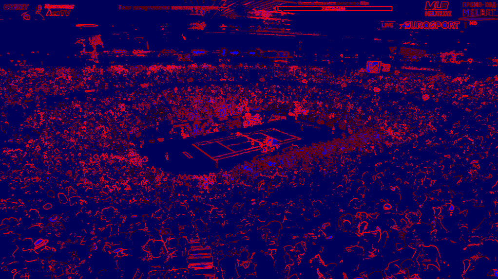
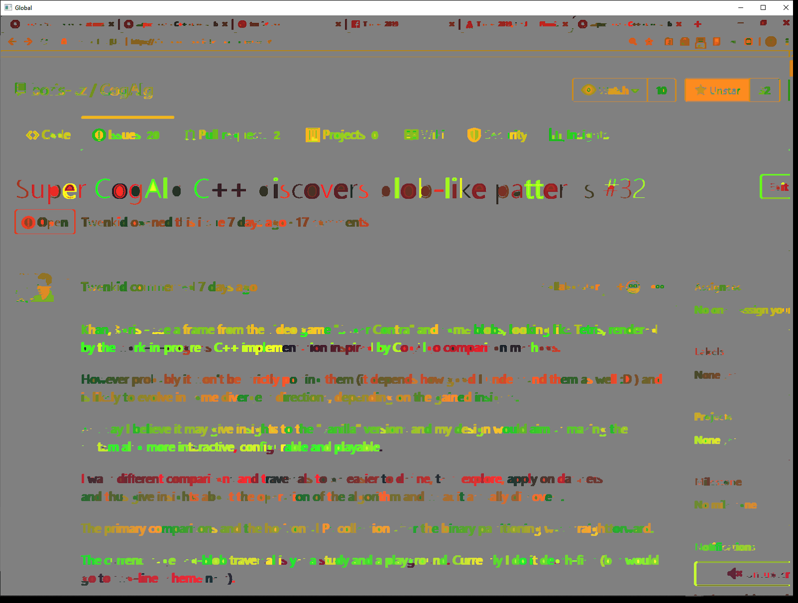
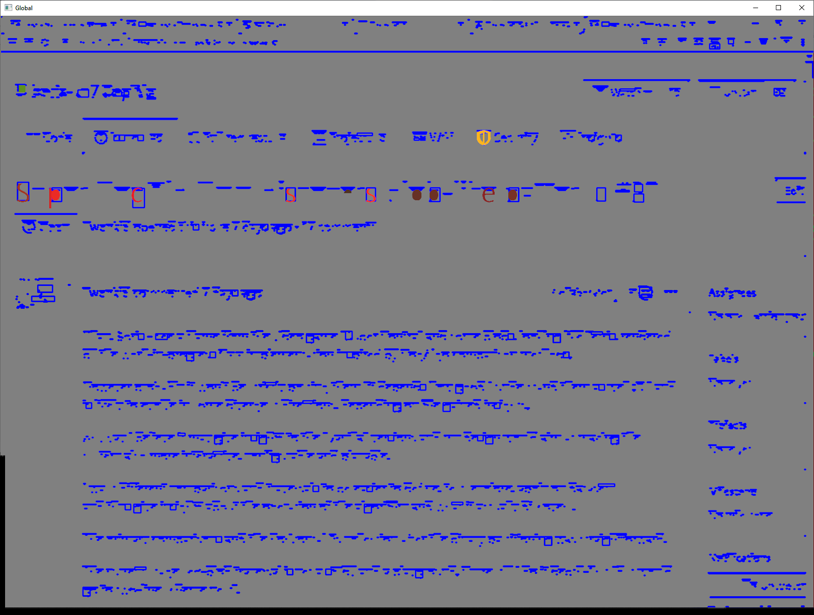
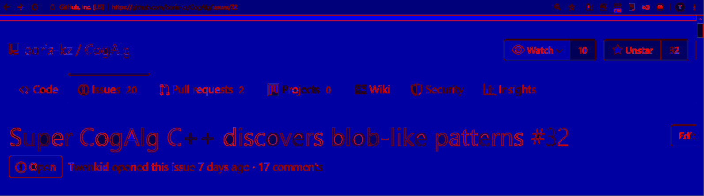
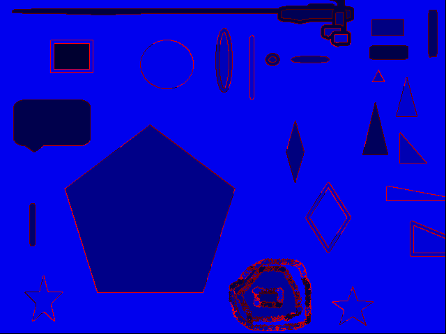
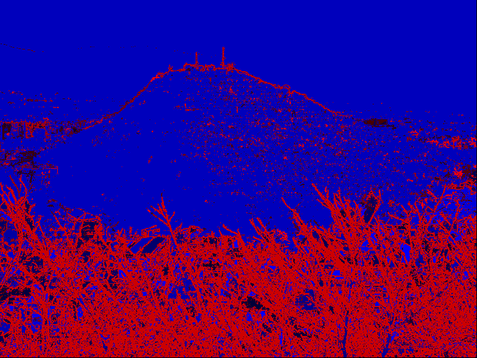

# SuperCogAlg
Incremental Machine Learning * Computer Vision * Artificial General Intelligence project by Todor Arnaudov.

http://research.twenkid.com

https://artificial-mind.blogspot.com/2019/07/supercogalg-cogalg-frame-blobs.html

https://artificial-mind.blogspot.com/search?q=supercogalg

https://artificial-mind.blogspot.com/2019/05/call-for-co-founders-of-r-startup-in.html

